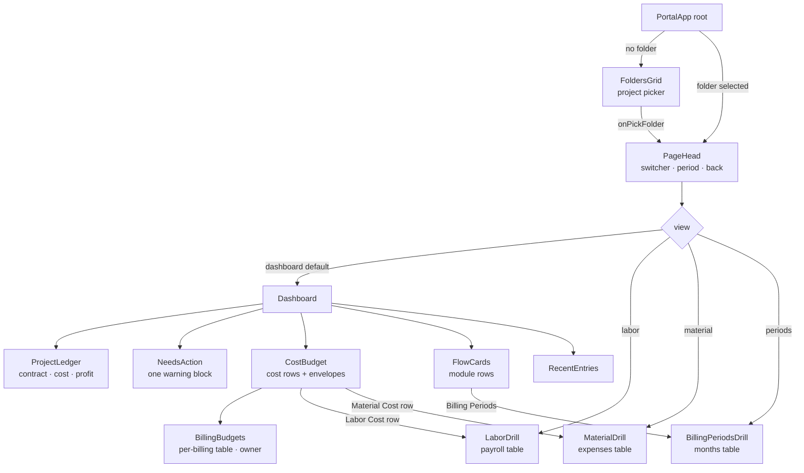

# Project Control — Module Chart

> Current structure of the **Project Control** module as implemented in
> [`admin.html`](../admin.html) (the `<script type="text/babel">` React section,
> mounted at `#dacsPortalRoot`).
> Last reviewed: 2026-05-30.

---

## 1. Data sources → State

All loaded live (real-time `onSnapshot`), filtered by `userId`
([admin.html:4099–4107](../admin.html#L4099-L4107)).

| Firestore collection | State variable | Becomes | Mapper |
|----------------------|----------------|---------|--------|
| `folders`  | `foldersRaw`  | Project folders (e.g. "Barlin Residence") | `buildProject` |
| `projects` | `monthsRaw`   | Billing periods / monthly budgets (`folderId` link) | `mapMonthlyProject` |
| `expenses` | `expensesRaw` | **Material** transactions | `mapExpenseDoc` |
| `payroll`  | `payrollRaw`  | **Labor** transactions | `mapPayrollDoc` |

---

## 2. Navigation hierarchy

```
PortalApp  (root)
│
├─ [no folder selected]  ──►  FoldersGrid              ← entry point / project picker
│                                (folder cards + health badge)
│
└─ [folder selected]     ──►  PageHead                 (project switcher · period filter · back)
                              │
                              ├─ view = 'dashboard'  (default)
                              │     ├─ ProjectLedger      contract · cost · profit · funding
                              │     ├─ NeedsAction        every warning, in one block   (owner/admin)
                              │     ├─ CostBudget    ──►  click a row opens a drill view
                              │     │    └─ BillingBudgets  budget per billing table    (owner)
                              │     ├─ ExpenseInboxMount
                              │     ├─ KPIStrip           cover-expense banner          (staff only)
                              │     ├─ FlowCards     ──►  Billing Periods · Additional Works
                              │     ├─ BillingSummary
                              │     └─ RecentEntries
                              │
                              ├─ view = 'labor'     ──►  LaborDrill           (payroll table)
                              ├─ view = 'material'  ──►  MaterialDrill        (expenses table)
                              └─ view = 'periods'   ──►  BillingPeriodsDrill  (projects/months table)
```

### As a Mermaid diagram



---

## 3. Dashboard contents

Redesigned 2026-09-22 (design 1A, "one story, top to bottom"). The Gross Profit
banner, the four-card project snapshot, the three cost cards and the allocation
rollup all stated the same pesos; they were merged so each figure is printed once.

### ProjectLedger — `js/portal-app.compiled.js`
Three numbers, then the line that qualifies them:

```
┌ Total Contract ──────┬ Actual Cost ─────────┬ Net Profit · Forecast ┐
│ ₱ contract           │ ₱ Labor+Mat+OH       │ ₱ earned − cost       │
├──────────────────────┴──────────────────────┴───────────────────────┤
│ Fund Allocated · Budget Remaining · Cover Expenses (subset of cost)  │
│ footnote: why the profit is a Forecast, or how much is Earned        │
└─────────────────────────────────────────────────────────────────────┘
```

`Net Profit` reads **· Forecast** until the accomplishment report signs work off,
and **· Earned** after. Staff get percentages only: no peso, no funding line.

**The ledger reports no billing progress at all** (removed 2026-09-22): no
"Billed to date" bar, no "Left to bill", no "Not linked" prompt, and the
component takes no `billing` prop. The Accomplishment Report is a *report* the
office raises — what has been billed against it is read in **Billing & Reports**,
and an unlinked BOQ is never presented as something this project owes. Accomplishment
data still drives the banner's **Earned vs Forecast** label; that is a money rule,
not a billing progress bar.

### NeedsAction — `js/portal-app.compiled.js`
Every warning in one block, each row with the button that fixes it: receipts
waiting in the Expense Inbox and overhead filed under no billing (→ Overhead).
Owner/admin only; nothing pending reads "All caught up". An unfunded billing and
an unlinked BOQ are both the **normal** state and are never listed here.

### CostBudget — `js/portal-app.compiled.js`
Four blocks with air between them, each opening its transaction history. The
`16px` gap is load-bearing: it is what says Labor and Material answer to the
envelope inside **their** block and not to the one below it.

```
COST AND BUDGET  ·  What was spent, and whether it fits the budget    [chip]

┌─ ● DIRECT COSTS · Labor and materials share one budget ──────────────┐
│ Labor Cost      Spent ₱ …   Share of contract  8.0%  ▓░░░░░░░░░   →  │
│ Material Cost   Spent ₱ …   Share of contract 23.7%  ▓▓▓░░░░░░░   →  │
│ One budget covers Labor and Material   Budget ₱ …  Left ₱ …  (owner)  │
└──────────────────────────────────────────────────────────────────────┘
┌─ ● INDIRECT COSTS · Running the site — its own separate budget ──────┐
│ Overhead Cost   Spent ₱ …   Share of contract  1.5%  ▓░░░░░░░░░   →  │
│ Budget for Overhead Cost               Budget ₱ …  Left ₱ …  (owner)  │
└──────────────────────────────────────────────────────────────────────┘
┌──────────────────────────────────────────────────────────────────────┐
│ Target Margin Reserve   Earned so far · reserve · variance   (owner)  │
└──────────────────────────────────────────────────────────────────────┘
┌──────────────────────────────────────────────────────────────────────┐
│ Total spent  ₱ …   ▓▓▓▓░░░░░░   33.2% of ₱ … contract                │
└──────────────────────────────────────────────────────────────────────┘
```

The direct-cost envelope covers Labor **and** Material and is never split between
them, so it is shown once on a shared strip at the foot of its own block rather
than repeated per row.

The group **headers** are for everyone — direct vs indirect is an accounting
fact, not a planning one — but their notes are not: an admin reads "Spent
straight on the job" and "Running the site", never a word about an envelope.
For a non-owner the two budget strips and the reserve block are absent entirely,
so the card is three blocks, not four. `BillingBudgets` follows as its own card
(owner only).

### A billing period is not a month

The client does **not** pay monthly. Money arrives when a billing is raised and
collected, so every period is named by the billing it is — **Mobilization**,
**Downpayment**, **Progress Billing #2**, **Final Payment** — with the month it
was raised shown underneath as context only. `_pcBillingName()` and the single
`FUNDING_LBLS` table are the one place that naming lives, so the overview and
`BillingPeriodsDrill` cannot drift apart.

`monthlyBudget` is that billing's **Fund Allocated: the money actually in hand.**
When a client pays more than was requested, the owner raises it to what really
arrived; the stored 70/20/10 percentages re-split the larger base on their own,
so no envelope has to be re-entered.

A billing with no Fund Allocated or no split yet is the **normal** state — work
routinely runs ahead of collection — so it is never an item in `NeedsAction`.
`BillingBudgets` hides itself entirely until at least one billing has a split:
with none, every column but Spent reads "Not set up" / "—" / "No budget", which
is a table of blanks that only nags. It returns on its own once a split is set,
and the "Cost and budget" chip reports the state meanwhile.

### RecentEntries — [admin.html:3742](../admin.html#L3742)
Combined latest labor + material transactions, tab-filtered (**All / Labor / Material**).

---

## 4. The money model

Computed in `buildProject` ([admin.html:3289](../admin.html#L3289)):

```
revenue      = folder.totalBudget
allocated    = Σ childMonths.monthlyBudget       (client-funded periods only)
labor        = direct + (liability − liabilityIndirect)
material     = Σ expenses.amount
overhead     = indirect + liabilityIndirect + overhead_expenses
spent        = labor + material + overhead       (_projSpent)
earned       = % complete × contract             (from the BOQ accomplishment report)
Net Profit   = earned − spent                    (_projMargin)
```

With no accomplishment data `earned` falls back to the full contract, and the
figure must be labelled **Forecast**, never Earned. Indirect labor is overhead,
not labor — counted once, never both. See `CLAUDE.md` § Money invariants.

### Folder health badge — [admin.html:3348](../admin.html#L3348)

```
remaining% = (allocated − spent) / allocated × 100

  ≤ 0   →  OVER       (red)
  < 10  →  CRITICAL   (red)
  < 20  →  WARNING    (amber)
  else  →  HEALTHY    (green)
```

---

## 5. Notes / design rules

- **Contract Revenue** and **Net Profit** are *numbers* (the ProjectLedger strip), **not** modules.
  Only **Labor**, **Material**, and **Billing Periods** are full modules (own table + list + add/edit/delete).
- The Material card's **"Files Attached `x / y`"** counter counts only the 4 supporting-document
  fields (`poImageUrl`, `deliveryReceiptUrl`, `supplierInvoiceUrl`, `paymentReceiptUrl`);
  `y = transactions × 4`. General **receipt** images (`receiptImages` / `receiptURL`) are tracked
  separately and do **not** count toward this number.
- Clicking a **MaterialDrill** row opens a lightbox with that entry's attached images
  (receipts first, then any PO/DR/SI/PR documents).

---

## Component index (file map)

| Component | Location |
|-----------|----------|
| `PortalApp` (root) | [admin.html:4066](../admin.html#L4066) |
| `buildProject` | [admin.html:3289](../admin.html#L3289) |
| `FoldersGrid` | [admin.html:3356](../admin.html#L3356) |
| `PageHead` | [admin.html:3440](../admin.html#L3440) |
| `ProjectLedger` | `js/portal-app.compiled.js` |
| `NeedsAction` | `js/portal-app.compiled.js` |
| `CostBudget` · `BillingBudgets` | `js/portal-app.compiled.js` |
| `KPIStrip` (staff cover banner) | `js/portal-app.compiled.js` |
| `FlowCards` (module rows) | `js/portal-app.compiled.js` |
| `BillingPeriodsDrill` | [admin.html:3642](../admin.html#L3642) |
| `RecentEntries` | [admin.html:3742](../admin.html#L3742) |
| `LaborDrill` | [admin.html:3835](../admin.html#L3835) |
| `MaterialDrill` | [admin.html:3964](../admin.html#L3964) |
