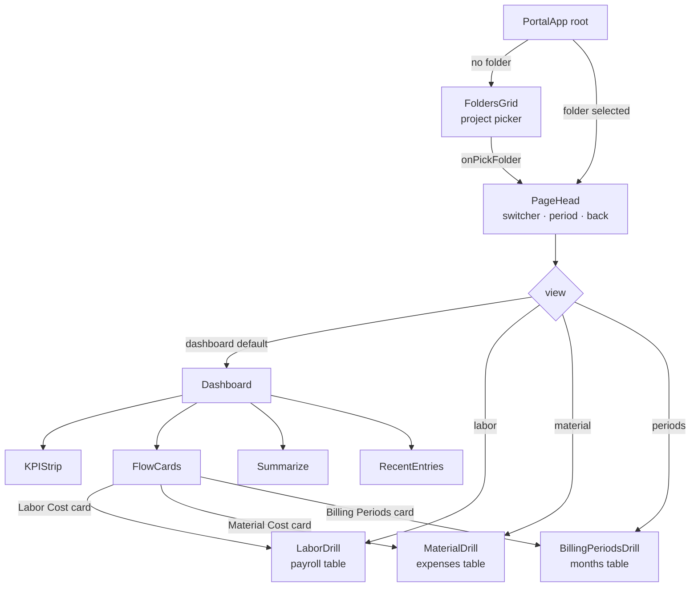

# Project Control — Module Chart

> Current structure of the **Project Control** module as implemented in
> [`admin.html`](../admin.html) (the `<script type="text/babel">` React section,
> mounted at `#dacsPortalRoot`).
> Last reviewed: 2026-05-30.

---

## 1. Data sources → State

All loaded live (real-time `onSnapshot`), filtered by `userId`
([admin.html:4099–4107](../admin.html#L4099-L4107)).

| Firestore collection | State variable | Becomes | Mapper |
|----------------------|----------------|---------|--------|
| `folders`  | `foldersRaw`  | Project folders (e.g. "Barlin Residence") | `buildProject` |
| `projects` | `monthsRaw`   | Billing periods / monthly budgets (`folderId` link) | `mapMonthlyProject` |
| `expenses` | `expensesRaw` | **Material** transactions | `mapExpenseDoc` |
| `payroll`  | `payrollRaw`  | **Labor** transactions | `mapPayrollDoc` |

---

## 2. Navigation hierarchy

```
PortalApp  (root)
│
├─ [no folder selected]  ──►  FoldersGrid              ← entry point / project picker
│                                (folder cards + health badge)
│
└─ [folder selected]     ──►  PageHead                 (project switcher · period filter · back)
                              │
                              ├─ view = 'dashboard'  (default)
                              │     ├─ KPIStrip
                              │     ├─ FlowCards   ──► click opens a drill view
                              │     ├─ Summarize
                              │     └─ RecentEntries
                              │
                              ├─ view = 'labor'     ──►  LaborDrill           (payroll table)
                              ├─ view = 'material'  ──►  MaterialDrill        (expenses table)
                              └─ view = 'periods'   ──►  BillingPeriodsDrill  (projects/months table)
```

### As a Mermaid diagram



---

## 3. Dashboard contents

### KPIStrip — [admin.html:3509](../admin.html#L3509)
Five headline numbers:

```
Contract | Spent | Gross Profit | Margin % | Budget Used %
```

### FlowCards — [admin.html:3539](../admin.html#L3539)
Three clickable module cards:

```
┌─ Labor Cost ─────────┐  ┌─ Material Cost ───────┐  ┌─ Billing Periods ─────┐
│ ₱ total              │  │ ₱ total               │  │ N periods             │
│ By Tag:              │  │ Per-Transaction Files:│  │ Allocation by Period: │
│  • Direct            │  │  • Transactions       │  │  • Total Allocated    │
│  • Indirect          │  │  • Files Attached x/y │  │  • Total Spent        │
│  • Liability         │  │   (PO·DR·SI·PR)       │  │  • Remaining          │
│ → Transaction Hist.  │  │ → Transaction Hist.   │  │ → Manage Periods      │
└──────────────────────┘  └───────────────────────┘  └───────────────────────┘
```

### Summarize — [admin.html:3621](../admin.html#L3621)
The profit formula, rendered literally:

```
   Contract Revenue   −   Summarize(Labor + Material)   =   Gross Profit
   (totalBudget)          (actual cost)                     (revenue − cost)
```

### RecentEntries — [admin.html:3742](../admin.html#L3742)
Combined latest labor + material transactions, tab-filtered (**All / Labor / Material**).

---

## 4. The money model

Computed in `buildProject` ([admin.html:3289](../admin.html#L3289)):

```
revenue      = folder.totalBudget
allocated    = Σ childMonths.monthlyBudget
labor        = Σ payroll.amount          (split: direct / indirect / liability)
material     = Σ expenses.amount
spent        = labor + material
Gross Profit = revenue − spent
```

### Folder health badge — [admin.html:3348](../admin.html#L3348)

```
remaining% = (allocated − (labor + material)) / allocated × 100

  ≤ 0   →  OVER       (red)
  < 10  →  CRITICAL   (red)
  < 20  →  WARNING    (amber)
  else  →  HEALTHY    (green)
```

---

## 5. Notes / design rules

- **Contract Revenue** and **Gross Profit** are *numbers* (KPI / Summarize sections), **not** modules.
  Only **Labor**, **Material**, and **Billing Periods** are full modules (own table + list + add/edit/delete).
- The Material card's **"Files Attached `x / y`"** counter counts only the 4 supporting-document
  fields (`poImageUrl`, `deliveryReceiptUrl`, `supplierInvoiceUrl`, `paymentReceiptUrl`);
  `y = transactions × 4`. General **receipt** images (`receiptImages` / `receiptURL`) are tracked
  separately and do **not** count toward this number.
- Clicking a **MaterialDrill** row opens a lightbox with that entry's attached images
  (receipts first, then any PO/DR/SI/PR documents).

---

## Component index (file map)

| Component | Location |
|-----------|----------|
| `PortalApp` (root) | [admin.html:4066](../admin.html#L4066) |
| `buildProject` | [admin.html:3289](../admin.html#L3289) |
| `FoldersGrid` | [admin.html:3356](../admin.html#L3356) |
| `PageHead` | [admin.html:3440](../admin.html#L3440) |
| `KPIStrip` | [admin.html:3509](../admin.html#L3509) |
| `FlowCards` | [admin.html:3539](../admin.html#L3539) |
| `Summarize` | [admin.html:3621](../admin.html#L3621) |
| `BillingPeriodsDrill` | [admin.html:3642](../admin.html#L3642) |
| `RecentEntries` | [admin.html:3742](../admin.html#L3742) |
| `LaborDrill` | [admin.html:3835](../admin.html#L3835) |
| `MaterialDrill` | [admin.html:3964](../admin.html#L3964) |
