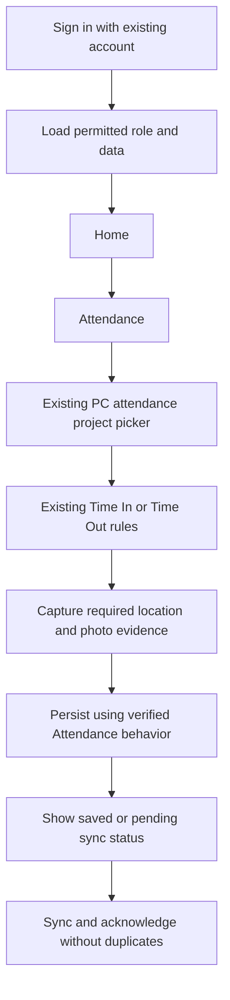
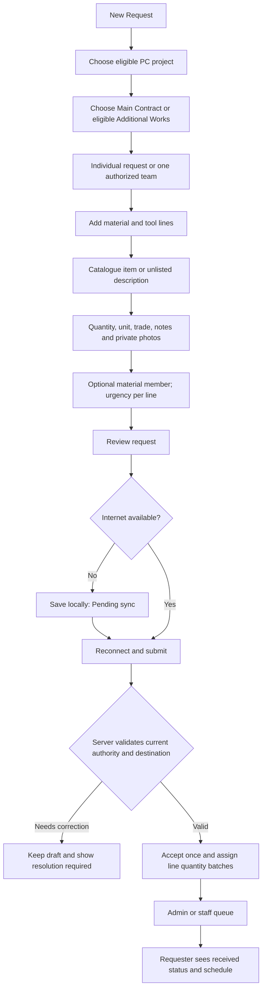
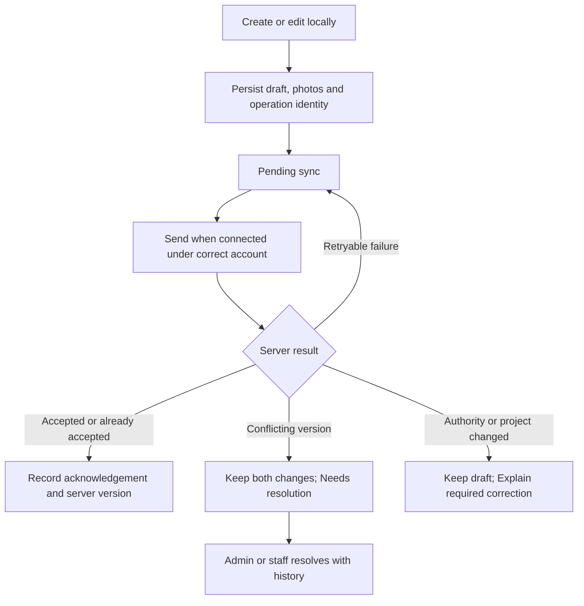
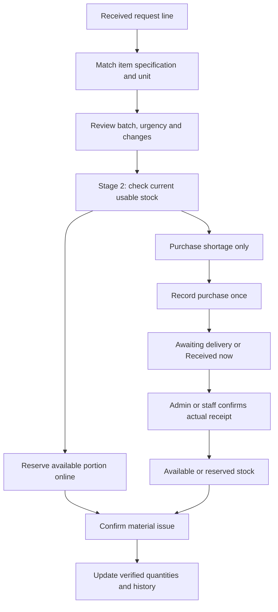
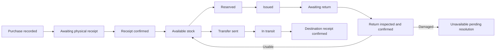
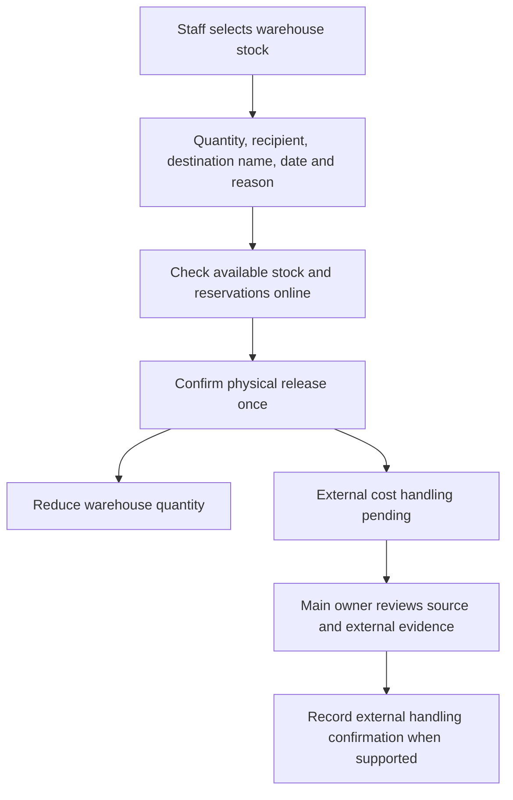
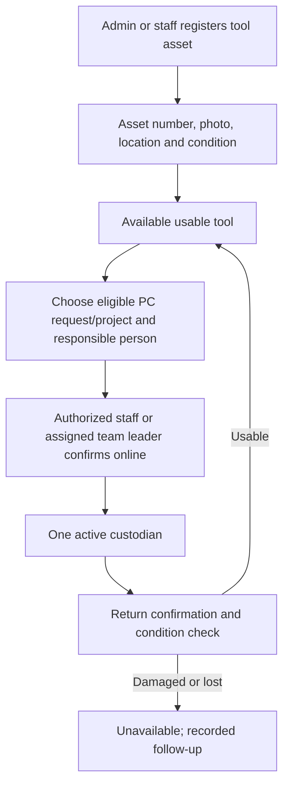
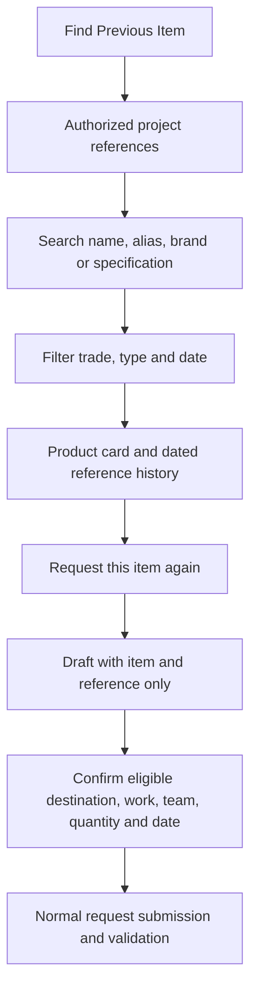

# DAC’S WorkMate — MVP Workflow and Prototype Guide

Date: 29 September 2026

Status: Design handoff for Claude Code. This guide does not implement the app, repair storage or verify a release.

## 1. Purpose and source of truth

Build **DAC’S WorkMate**, a new worker app by Dacs Building Design Services, using **Flutter with Dart**. Combine Attendance, material/tool requests and, in later MVP stages, inventory visibility and tool responsibility. Admin/staff manages operations through **Dacs Web**. Keep existing Supabase accounts and data.

Read the [approved decisions and detailed MVP scope](2026-09-29-unified-worker-app-design.md) alongside this guide. That document is the business-rule source of truth; this companion organizes the work, user journeys and prototype deliverables. Read [system architecture](../../ARCHITECTURE.md) before technical planning. Resolve discrepancies explicitly rather than silently choosing a new rule.

“Full MVP” means all stages below. “First pilot” means Stage 1a with preserved Attendance behavior. A clickable prototype demonstrates navigation and examples; it does not prove database permissions, offline reliability or stock accuracy.

## 2. What to do first

| Order | Work | Output and completion condition |
|---|---|---|
| 1 | Read the scope and inspect current Attendance behavior. | A rule checklist and an Attendance parity checklist grounded in the existing implementation. |
| 2 | Map role-based journeys and exceptional cases. | Flowcharts for the journeys in this guide; identify unresolved choices without inventing answers. |
| 3 | Map screens and sketch simple layouts. | Worker, leader and Web screen map, including empty, offline, loading, error and restricted states. |
| 4 | Build a clickable prototype with sample data. | Demonstrate the first-pilot journeys end to end. Label later-stage examples and simulated operations. |
| 5 | Review the prototype with the owner and representative workers/staff. | Record confusing steps, agreed changes and business-rule changes in the source MVP document. |
| 6 | Prepare focused implementation plans. | Separate storage-repair and Stage 1a plans, with inspected files/schema, access rules, migration, tests and rollout. |
| 7 | Implement and verify the storage repair and Stage 1a. | Working Flutter app and Web queue; access and offline acceptance checks pass before pilot. |
| 8 | Pilot with a small representative group, then expand by stage. | Actual-device results and resolved issues before broader rollout. |

Start the **separate storage repair plan alongside design work**. It does not depend on prototype approval and must be implemented and verified before the live pilot. Use synthetic data and non-sensitive sample photos for the prototype.

The first concrete design deliverable is one complete journey: worker creates a request, admin/staff receives it, worker sees its assigned schedule and subsequent edits. Show an individual request, a combined team request and a late offline submission.

## 3. Confirmed boundaries

- Attendance and new procurement project destinations are **Project Control only**. Project Management remains a separate operation.
- A similar PC/PM project name is not evidence of duplicate records. Never automatically merge or link them.
- Requests go straight to admin/staff. No team-leader approval gate and no separate request-approval stage.
- A request has one PC project, Main Contract or one valid Additional Works job, and at most one team. Materials may name an intended member per line.
- Workers may belong to multiple teams. Workers without a team may submit individually.
- A leader may act for a team only with both the team-leader role and an explicit current assignment as that team's leader.
- All staff may encode and review purchase amounts/receipts. Preserve existing staff payroll access as a documented exception; do not redesign payroll permissions here.
- Workers and leaders cannot access procurement peso amounts through screens, photos, notifications, cached data, exports or direct calls.
- Main owner: **admin@dacsbuilding.com**. Privileged actions must bind to the verified account identity on the server, not a supplied email string.
- Use new procurement tables with stable request/line identities. Preserve old requests as properly scoped read-only history.
- Physical stock actions, reservations, tool handovers and cost assignments require internet. Offline requests and existing offline Attendance remain supported.
- Flutter is confirmed. Whether iPhone ships in the first release and the installation/package migration strategy are not yet decided.

## 4. Role and screen map

These are proposed navigation labels, not additional permissions.

| Surface | Screens | Stage |
|---|---|---|
| Worker mobile | Sign in, Home, Attendance capture/history, Requests list, New/Edit Request, Item selection, Request detail, Sync status, Profile | 1a |
| Team-leader mobile | Worker screens plus own assigned-team selector and combined team requests | 1a |
| Worker/leader mobile | Find Previous Item, project photo cards, reference detail, Request Again | 1b |
| Worker/leader mobile | Verified item fulfillment and availability in request details | 2 |
| Worker mobile | My Tools, asset detail, responsibility/return history | 3 |
| Team-leader mobile | Own-team tool issuance/return confirmation | 3 |
| Dacs Web admin/staff | Request queue, urgent queue, batch calendar, line detail/change history, catalogue matching, team/leader setup, project request availability, conflict resolution | 1a |
| Dacs Web admin/staff | Reference search, historical reference entry, product-photo review | 1b |
| Dacs Web admin/staff | Purchasing, receipt, locations/balances, reservations, issues, returns, transfers, corrections, release to other job | 2 |
| Dacs Web admin/staff | Tool register, opening register, issuance/returns, condition | 3 |
| Dacs Web main owner | Pending cost assignment, PC cost transfer, external cost review | 4; earlier release evidence behavior requires its focused decision |

Do not make unavailable stages appear functional in the pilot. Later-stage prototype screens may be included as clearly labelled previews.

## 5. Attendance and entry flow

This is a high-level parity flow, not a replacement Attendance algorithm. Before coding, inspect and document the existing checks, capture order, timestamps, permissions, retries, Time Out rules and failure behavior. Recreate them in Flutter and test against the current app.

Request-only projects must not appear in Time In. PC hidden-site handling remains the existing picker behavior: delayed offline attendance is not newly rejected merely because a site was hidden later. Material requests do not create attendance or determine payroll.

Migration must preserve accounts, historical records and pending attendance/photos. A separately installed app cannot be assumed to read the previous app's local queue. Verify migration/sync completion before retiring the current app.

## 6. New request: worker or leader

The server checks the parent PC project, the chosen AW's ownership and completion, request availability and current team authority. Completed parent or completed AW blocks a new request; an open child cannot bypass a completed parent. Returns and authorized history remain possible.

Admin/staff can explicitly enable upcoming PC sites with **Allow requests**, independently of Attendance visibility. Time In is not a prerequisite for requesting.

Each line contains type, item/specification, quantity/unit, trade, optional notes/photos and optional material recipient within the selected team. A named tool custodian is required at issuance, not initial request. Missing catalogue items may still be submitted. Admin/staff maps them before stock tracking.

Keep different specifications and units distinct. For the MVP, no automatic unit conversion: each unit is its own catalogue item. An alias helps search; it does not create duplicate stock or merge a box with a piece.

## 7. Scheduling and quantity-change rules

| Event | Rule and visible result |
|---|---|
| Regular request received | Default Saturday cutoff, Monday purchasing, Wednesday expected delivery. Exact Saturday time belongs in the Stage 1a plan. |
| Offline draft syncs late | Use server receipt time in Asia/Manila. Assign the next applicable batch; show the assigned batch after acceptance. |
| Accepted operation retries | Preserve its identity and batch; do not create another request. |
| One item is urgent | Require reason and needed-by date; place that line in the urgent queue without making every line urgent. |
| Staff adjusts schedule | Update planned purchase/delivery dates and display them to requester; preserve actual completed-event dates. |
| Quantity increases after cutoff | New quantity portion enters next batch by default. Preserve arranged portions; staff may override with history. |
| Quantity decreases | Reduce newest unarranged portion first. Flag arranged/purchased/issued excess for appropriate handling. |

Example: 10 arranged this week plus 2 unarranged next week, reduced to 9. Remove the later 2 first, then flag 1 arranged unit for staff action. Do not rewrite the original purchase or imply goods were returned.

The requester and admin/staff may edit quantities; leaders edit combined requests they submitted. Record actor, time, reason and changes. Substitutions retain the original reference, replacement and explanation.

## 8. Offline and conflicting edits

- Distinguish **Draft**, **Pending sync**, **Received**, **Failed** and **Needs resolution**. These are synchronization labels, not proof of purchase or delivery.
- Closing the app must not erase queued work or pending photos.
- An account switch must not expose or submit another account's data.
- A timeout may follow a successful server save; retry the same operation identity.
- Worker changes quantity to 8 offline while staff changes it to 12: retain both, show conflict and route to staff resolution.
- Attendance sync remains independent of procurement failures.
- Photo cleanup must not remove unsent attachments. Exact retry/backoff, attachment acknowledgment and local storage design belong in the implementation plan.

## 9. Admin/staff processing and purchasing

Stage 1a provides the queue, catalogue matching, scheduling and changes. Stage 2 adds verified purchasing and movement quantities. A prototype may simulate Stage 2 but must label it accordingly.

Example: need 10 outlets; reserve 4 on hand and purchase 6. Never promise the same last 4 to two requests. Payment is not receipt. Entering an expense, marking delivery and retrying a confirmation must not add stock three times.

The Materials option becomes **Track this purchase in inventory**, followed by **Received now** or **Awaiting delivery**. Link the expense and purchase without duplicate spending. Preserve actual quantities/unit costs separately from expense funding splits.

Show demand, purchased, received, issued and outstanding quantities separately when backed by records. Do not use one overall request status to conceal partially fulfilled lines or split batches. Fulfillment status definitions must be specified in the Stage 2 plan.

## 10. Inventory, surplus, returns and transfers

| Action | Required behavior |
|---|---|
| Receipt | Admin/staff records actual quantity, location, condition and confirmer. Undelivered goods are unavailable. |
| Reservation | Online, checks availability and prevents competing requests using the same quantity. |
| Issue | Record physical departure and destination; issued stock is not available store stock. |
| Return | Awaiting return until admin/staff confirms actual received quantity and condition. |
| Transfer | Send from source, show in transit, then confirm receipt at destination. Keep shortages/damage visible. |
| Correction | Preserve prior movements and record a traceable correction; never erase history to force a balance. |

This diagram illustrates common paths, not an exhaustive database state machine. Direct issues, partial receipts and partial returns must also be covered by the focused plan.

If 10 were bought and need becomes 8, preserve purchase quantity 10. The extra 2 are inventory only after physical receipt. If already issued, they remain awaiting return until confirmed. Cancellation does not delete purchases, open tool loans or return obligations.

Track warehouse and site quantities by specification/unit and source. Suggest oldest usable received stock first. Verify opening counts; unknown historical costs remain unknown until supported main-owner verification.

## 11. Release stock to other job

This limited staff warehouse operation covers **materials**, including use on an external PM job. It does not add PM to the worker picker.

Keep source-stock links and actor. Do not consume another request's reserved stock silently. Release 5 of 20 bags: physical stock becomes 15 immediately, even if financial review is pending. No PM record, payment, expense or automatic PC-to-PM cost transfer is created.

Only the main owner confirms external handling with reference/explanation. Unknown costs remain unresolved. Returns and corrections link to the release. Stage 2/4 plans must settle partial-return reconciliation and the distinction between evidence-only acknowledgement and peso reconciliation. Project-sourced leftovers require review of their original PC cost; external acknowledgement alone cannot reduce that project's Spent.

## 12. Reusable tools

Register actual assets such as TOOL-0001. Consumables such as drill bits remain quantity-based materials. A tool model may be requested; a particular asset is allocated only when available.

Admin/staff confirms newly purchased tools entering stock. Team leaders handle issuance/returns only for their assigned teams. Record person, project, issuer and condition. The person remains responsible despite team changes or account deactivation. Returns stay linked to original custody even when the project is completed or hidden. No automatic salary deduction for loss/damage.

Outside-job tool lending is not approved by the material-release exception. Resolve that separately before enabling any such action. QR labels are optional after basic asset tracking.

## 13. Find Previous Item and request again

Cards show safe product photo or placeholder, item/specification/unit, project and Main Contract/AW labels. Preserve historical descriptions and substitutions. A linked expense plus receipt must not look like two purchases.

Request-again never copies payment, cost, stock reservation, purchase status or tool custodian. It does not transfer old stock and does not submit automatically.

Before Stage 2, show requested events and labelled **Historical references** only. Later show verified purchase, receipt, issue and return events separately from current stock. “Issued” does not prove “installed” or “consumed.”

Seed useful references for active PC sites with staff. A historical photo creates no expense, stock or invented purchase. Old requests without a project require explicit staff mapping before inclusion. No bulk Messenger import or automatic image recognition in this MVP.

Raw request photos stay private to requester, authorized leader and admin/staff. Only staff-approved safe product photos enter the gallery. Review visible prices and personal information; replacements require review again. Store raw private request attachments separately from legacy uploads starting in Stage 1a; Stage 1b adds separate controlled gallery storage.

History authorization must be defined before Stage 1b. A previous request is not permanent permission to see all project history. Offline browsing uses bounded account-scoped cached references, last-updated labels and no promise of current stock. Keep pending uploads outside gallery cleanup.

## 14. Cost flow — Stage 4

Physical movement and financial attribution are distinct. Staff records movements; the main owner confirms authorized financial assignments and transfers.

| Scenario | Cost rule |
|---|---|
| Project A buys materials | Preserve original expense, receipt and cost source. |
| A's leftovers move to warehouse | Location changes; cost remains with A. |
| B receives A's leftovers | Main owner may authorize balanced PC-to-PC cost transfer using original cost. |
| Company buys general warehouse stock | Unused cost remains unassigned stock cost; main owner assigns issued portions to PC jobs. |
| External job receives materials | Physical release and pending/confirmed external handling stay traceable; no PM automatic entry. |

Example: A buys 10 outlets at PHP 100. B receives 2; an authorized PHP 200 transfer leaves A at PHP 800 and B at PHP 200. Total purchase cost remains PHP 1,000. Both financial sides must succeed together; retry must not duplicate them.

Before Stage 4, define receiving billing period, client/Cover funding treatment, source history and report effects. Main owner reviews billed/closed projects. No automatic changes to client invoices, fees, payroll, reimbursements or warranty reserves. Preserve the existing money model: no invented fourth spending category and no project charge for company overhead.

## 15. Prototype design requirements

- Use familiar labels, clear quantity/unit displays, readable text and comfortable touch targets. Confirm actual device needs with users.
- Keep one primary action clear per screen. Show project, Main Contract/AW and team before final submission.
- Make offline, pending, received and resolution states visibly different; never show success before local/server state supports it.
- Worker/leader layouts contain no procurement amounts or unsafe receipt thumbnails, including simulated notification previews.
- Show partial quantities and dates, such as “10 this week; 2 next week,” rather than hiding them behind a single status.
- Include no-photo, empty catalogue, unlisted item, no team, completed destination, revoked leader assignment, photo upload failure and conflicting-edit examples.
- Prototype role switching uses sample accounts; it is not evidence of real authentication or permission enforcement.
- Model full-MVP journeys with stage labels, but build the detailed interactive pilot first. Do not require advanced dashboards, supplier portals or automation to complete basic tasks.

### Demo script for the first review

1. Worker signs in and sees Attendance plus request updates.
2. Worker selects an upcoming request-enabled PC project without Time In; it does not appear as a new Attendance option.
3. Leader chooses their assigned team and submits electrical materials, plumbing materials and a tool in one request.
4. Worker adds an unlisted item/photo and marks only that item urgent.
5. Request prepared offline arrives after cutoff; it shows pending, then the server-assigned next batch.
6. Staff matches the item, changes an expected date and requester sees the update.
7. Add 2 to an arranged 10 after cutoff; display two quantity portions.
8. Reduce 12 to 9; show the newest portion removed and an arranged-unit action flagged.
9. Simulate competing offline/online edits and resolve without silently losing either version.
10. Try a completed AW and an unauthorized team; show a clear explanation and retained draft.

Separate later-stage demos cover purchase/receipt, surplus return, warehouse transfer, tool custody, safe photo history and owner cost review. They must not appear as already integrated pilot capabilities.

## 16. Delivery stages and exit checks

| Stage | Deliverable | Before release |
|---|---|---|
| Prerequisite | Document-storage repair | Verify current live policies and allowed/denied access. Preserve permitted PC/PM client and partner documents and staff encoding. |
| 1a | Flutter Attendance parity plus requests, catalogue, teams, PC/AW eligibility, batches, urgency, quantity portions, private photos and offline edits | Verify parity, safe transition, server permissions and retries. Remove legacy broad worker request access in UI and endpoints. |
| 1b | Searchable item references, approved gallery, request again, bounded caching | Define history permissions, seed safe PC references and test photo privacy/account isolation. |
| 2 | Purchasing and physical inventory, partial fulfillment, returns/transfers and external material release | Verify balances and duplicate prevention, replace conflicting stock-add paths and settle release/return evidence rules. Keep existing expense treatment until Stage 4. |
| 3 | Asset register, custody, leader handovers and condition-aware returns | Verify opening tool register, exclusive custody and team authorization. |
| 4 | Owner cost assignment/transfers and reconciliation | Verify funding/billing/report effects and balanced original-cost treatment, including external cost review. |

Do not retire the current Attendance app before the replacement and transition are verified. Confirm no active submissions remain in the old Flutter/Firebase prototype. Preserve old records without duplicating or fabricating new transactions.

## 17. Acceptance checklist

- [ ] Existing account accesses Attendance and requests without duplicate worker identity.
- [ ] Flutter reproduces verified Attendance behavior, including offline capture and recovery.
- [ ] Requests cannot target PM, completed PC parents or completed/foreign AW jobs through direct calls.
- [ ] A leader assigned to Team A cannot act for Team B using role alone.
- [ ] An individual with no team can request; a multi-team worker chooses one team per request.
- [ ] No leader approval gate appears before the staff queue.
- [ ] Late offline receipt, per-line urgency, split quantities and date overrides follow PH-time rules.
- [ ] App restart/retry/account switching does not lose, duplicate or expose another user's work.
- [ ] Conflicting edits preserve both versions and require staff resolution.
- [ ] Staff purchase encoding and existing payroll work remain available.
- [ ] Worker/leader direct calls and storage access cannot retrieve procurement amounts/private colleague records.
- [ ] Legacy broad worker access is replaced, not merely hidden.
- [ ] New private photos never enter legacy shared uploads; approved gallery photos are separately controlled.
- [ ] Purchase/payment/receipt retries do not duplicate expense or stock.
- [ ] Partial receipts, reservations, surplus, returns and transit quantities reconcile physically.
- [ ] Concurrent users cannot reserve the same last stock or issue the same tool twice.
- [ ] External material release reduces stock once, preserves pending cost and creates no PM transaction.
- [ ] Historical references do not create stock; request-again does not copy old financial/custody state.
- [ ] Owner-only cost transfers preserve total original cost and existing financial/report invariants.

Run only the checks relevant to each stage before that stage's release; full-MVP checks do not imply all features belong in Stage 1a.

## 18. Decisions to resolve at the appropriate stage

These do not reopen settled business choices. Record outcomes in the source MVP document.

| Timing | Remaining detail |
|---|---|
| Before detailed Stage 1a implementation | First-release platforms; package/repository and installation transition; minimum supported devices; verified Attendance parity checklist; exact Saturday cutoff; notification channels; schema/functions and failure handling. |
| Before Stage 1b | Who can browse each project's shared references, revocation/cache behavior and cache size limit. |
| Before Stage 2 | External-release evidence acknowledgement timing; project-sourced leftover review; partial returns before/after confirmation and outstanding quantity handling. |
| Before external tool lending | Explicit scope decision; material release does not authorize external tool custody. |
| Before Stage 4 | Cost reconciliation, source funding, receiving billing periods and financial report effects. |

## 19. Handoff brief for Claude Code

Use this brief with the source MVP scope:

> Design DAC’S WorkMate using the confirmed Flutter/Dart direction. Read the MVP scope and this workflow guide first. Begin with the role-based workflow diagrams and screen map, then create a clickable Stage 1a prototype using synthetic data. Cover the demo script and exception states. Preserve the current Attendance algorithm by inspecting the existing implementation; do not invent new attendance/payroll rules. Keep Project Management outside procurement, enforce one team per request, and do not add leader approval. Clearly distinguish prototype simulation, later-stage previews and real capabilities. Record any missing decisions without silently changing approved rules. After design review, prepare separate storage-repair and Stage 1a implementation plans grounded in the actual repositories and database schema. Do not treat a polished prototype as proof of secure or working backend behavior.

Expected design outputs: updated diagrams, a screen map, a clickable prototype, a review checklist and a concise decision log. Later implementation plans should name actual affected files/migrations, access rules, tests, transition and rollback steps after inspection; this guide intentionally does not invent those details.
