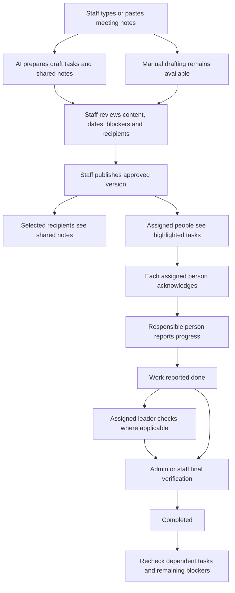

# DAC’S WorkMate — Meetings & Work Plan

Date: 30 September 2026

Status: Agreed feature decisions consolidated for written review. Design only; no application, database, AI service or notification changes have been made.

## 1. Purpose and scope

Turn meeting notes into clear assignments that workers can find, acknowledge and follow. Show what each person needs to do, when it is planned, and what must be ready before work can begin. Replace dependence on finding old Messenger messages with persistent tasks and selected shared meeting notes.

This is a companion to the [WorkMate MVP scope](2026-09-29-unified-worker-app-design.md) and [prototype/workflow guide](2026-09-29-workmate-prototype-and-workflow-guide.md). WorkMate uses Flutter with Dart; admin/staff operates through Dacs Web. Existing Attendance, procurement and money rules remain in force.

One meeting may cover multiple Project Control projects. Each task belongs to exactly one Project Control project and Main Contract or one valid Additional Works job. This does not introduce Project Management tasks, change Attendance or calculate payroll.

The feature is approved for design. Its release position is not yet assigned; do not silently enlarge Stage 1a or promise inventory integration before the supporting stage exists. Meeting scheduling, compulsory meeting attendance tracking and attendance penalties are not approved by this task-management design.

## 2. Approved flow

AI never publishes, assigns live work, changes dates or clears blockers by itself. Staff reviews the proposed recipients and content before publishing. Manual drafting/publishing remains possible if AI fails or is unavailable.

## 3. Roles and responsibility

| Role | Permission |
|---|---|
| Admin/staff | Enter notes; create/edit tasks; review AI drafts; select recipients; publish; resolve conflicts; clear blockers; give final completion approval; control reminders and approve schedule changes. |
| Assigned team leader | Propose tasks/problems for review; check work for their own assigned team; report progress when responsible. Cannot publish assignments or give final completion approval. |
| Named responsible person | One per team task; reports overall progress and submits the work as done. |
| Assigned helper | Reads and acknowledges their assignment; may report a blocker. Does not independently complete the whole task. |
| Selected meeting recipient | Reads the approved shared meeting version, including relevant other-team discussions. Visibility alone gives no edit, verification or completion authority. |

Every team task has one named responsible person and a list of helpers. Team-leader authority requires both the profile role and current assignment to that team, matching the source MVP. A leader cannot verify their own work; admin/staff checks it directly. Admin/staff final review is required even when a leader has already checked the work.

Team leaders may submit proposed tasks or problems for review. Proposals do not become live assignments until admin/staff publishes them. Reporting a blocker does not itself create a purchase or alter a deadline.

## 4. Meeting input and AI drafting

The MVP accepts typed or pasted text. Recording, audio storage and transcription are deferred.

Retain original notes separately from approved worker-visible content. Draft extraction should identify task instructions, project/work selection, responsible person, helpers, planned dates, material needs, preceding work and source passages. It also proposes shared highlights and likely recipients from authorized existing people/teams.

AI is an assistant, not a guarantee of complete or accurate interpretation. Unknown names, ambiguous dates, contradictory instructions and missing project details must be flagged for staff clarification. Do not invent deadlines, quantities, people or project matches. Preserve the source passage so staff can check each suggestion.

Suggested design safeguard: show unmatched note passages during review so staff can spot omitted decisions. Reprocessing notes must not silently duplicate published tasks or overwrite reviewed edits; propose changes for review with traceable source/version links.

Staff can correct the wording, add missing tasks, discard incorrect suggestions and publish without successful AI processing. AI failure must preserve notes and manual edits. AI provider, model, data handling, operating cost and quality checks belong in the technical plan; no provider is selected here.

## 5. Language and clarity

The user approved matching the meeting's language:

- Mostly Tagalog notes become clear, everyday Tagalog.
- Mixed English/Tagalog notes become natural, understandable Taglish.
- Keep familiar construction terms such as wiring, outlet and conduit when translation would reduce clarity.
- Use short, direct sentences. Avoid formal or technical wording that workers may misunderstand.
- Preserve names, quantities, dates, units, negation and conditions. Simplification must not change an instruction.
- Apply the language choice to shared notes, task descriptions, highlights and reminders. Admin/staff can edit all worker-facing wording before publication.
- Show an actual calendar date for relative phrases such as “next Monday.” Ask staff to resolve ambiguous references instead of guessing; use Philippine time.

Example Tagalog: “Simulan ang pagkakabit ng mga kable sa Lunes. Bago magsimula, kailangang makumpirma ng admin/staff na kumpleto ang materyales at tapos na ang paghahanda ng dingding.”

Example Taglish: “Start ng wiring sa Monday. Bago magsimula, kailangan munang i-confirm ng admin/staff na complete ang materials at tapos na ang wall preparation.”

These are wording examples, not published work instructions. The task's date field must identify the exact date. This language behavior does not by itself approve translation of the entire app interface.

## 6. Publishing and shared meeting notes

Workers receive two complementary views:

1. **My Tasks:** their highlighted instructions, responsibility, dates and blockers.
2. **Shared Meeting Notes:** the broader approved work discussion, including other teams' plans, so recipients can understand dependencies and remind colleagues.

Admin/staff selects recipient workers/teams; AI suggests the distribution. Nothing is sent before staff publishes. Do not broadcast to the whole company by default.

The shared version preserves the full work discussion intended for those recipients, but excludes restricted procurement prices, payroll details and private personnel information. Original raw notes remain with admin/staff. Staff reviews the actual shared version and recipient list; do not rely on AI redaction as the access-control boundary.

Notifications, attachments, summaries and cached versions must obey the same permissions as the task/shared note. Reading a shared description of another team's work does not grant access to their private requests, photos or records. Display only an authorized dependency summary where needed.

The prototype should present a combined review of proposed content and recipients for efficient publishing. Exact bulk/partial publication behavior must be specified in implementation planning so recipients never see an unreviewed or half-published assignment.

## 7. Acknowledgements and revisions

Every assigned person, including helpers, acknowledges individually with an action such as **I’ve read this**. Admin/staff can see outstanding acknowledgements. Acknowledging is separate from starting work, completing work or attending the meeting.

Important changes to instructions, assignments, project or dates require acknowledgement again from affected assigned people. Highlight what changed. Minor spelling corrections do not require a new acknowledgement.

Acknowledgements belong to the actual version read. An offline acknowledgement of an older version cannot acknowledge new instructions. Preserve who published and changed each version and who acknowledged it. Removal or reassignment must not erase historical responsibility or acknowledgements.

## 8. Blockers, materials and preceding work

Any assigned worker or helper may report a blocker. Notify the responsible person and admin/staff. Examples include missing materials, an unavailable tool, incomplete preparation or unfinished work by another team.

Link missing-material blockers to existing procurement requests when available. If no request exists, offer the normal request flow; do not silently create an order or duplicate a request from meeting text.

**Only admin/staff clears the material blocker after confirming the required materials are available for the task.** A purchase, delivery update or stale stock number alone is insufficient: quantities, specification, condition and location may be wrong. Clearing the blocker does not itself issue, reserve or consume inventory.

For work dependencies, a predecessor reported done or checked by a leader remains incomplete until admin/staff final approval. Then re-evaluate the dependent task's other blockers. Clearing one prerequisite cannot clear all remaining blockers. Detect invalid dependency cycles in the implementation design.

Show a readiness update when recorded prerequisites are satisfied; do not automatically mark work started. Until then, Start work and Report done stay locked (confirmed; see §14). The responsible person reports actual progress. Dependency readiness does not replace required site judgment or change attendance.

Until inventory integration exists, material readiness is a documented manual admin/staff check. Do not invent live availability from request status.

## 9. Completion and schedule changes

Suggested labels for the prototype distinguish **Not started**, **In progress**, **Blocked**, **Reported done**, **Awaiting admin/staff verification** and **Completed**. Record a leader's check separately. These labels express the approved process; the exact state transitions need a technical definition.

Completion flow: responsible person reports done; assigned leader checks where applicable; admin/staff verifies and marks completed. A leader's check never clears the final review requirement.

If earlier work is delayed, keep agreed dates, flag affected dependent tasks and suggest revised dates for staff review. Only a published staff-approved change alters the schedule. Notify affected people and require acknowledgement for the important change.

Rejected verification, rework, reopening a completed task and the effect on downstream work must be explicitly designed before implementation. Do not silently erase a prior approval or treat rejection as completion.

## 10. Automatic reminders

Automatic reminders are approved, with admin/staff control. Cover unacknowledged assignments and upcoming work; alert staff to overdue tasks and unresolved blockers. Group related reminders to avoid repeated notifications.

Distinguish blocked work from work that is simply late. Avoid treating the responsible person as having ignored a task when they have reported a blocker. A notification being sent does not prove it was read; use the explicit acknowledgement record.

Persistent My Tasks and meeting views are the record of work, not the push notification. Reminder cadence, quiet hours, escalation recipients and delivery channels must be specified before release. No salary deductions or attendance penalties follow from reminders or acknowledgements.

## 11. Offline behavior

Previously downloaded authorized tasks/notes remain readable offline with a last-updated indication. Workers may acknowledge, report progress and report blockers offline. Keep the changes and attachments locally and show **Pending sync** until server acceptance.

Final admin/staff completion approval and blocker clearance require internet. Server validation must recheck role, assignment, version and task state on sync. Keep conflicts visible for resolution rather than silently replacing staff changes or accepting outdated authority.

Retries must not duplicate reports, acknowledgements or notifications. Account switching must not reveal or send another worker's data. Do not let cache cleanup delete unsent work. Define attachment retention, cache revocation and retry handling in the technical plan.

## 12. Screens and prototype walkthrough

| Surface | Proposed views |
|---|---|
| Dacs Web | Meeting list/editor, AI/manual drafts, clarification list, task and recipient review, publication history, acknowledgement monitor, task board, blockers, completion verification and reminder controls. |
| Worker app | My Work with Today/Upcoming/Waiting, task detail, acknowledgement, report blocker, responsible-person progress, shared meeting notes, changes highlighted and pending sync. |
| Team leader | Own-team task/problem proposals and work-check queue, alongside ordinary worker views. |

Prototype scenario:

1. Staff pastes Tagalog/Taglish notes covering House A and House B.
2. AI proposes an electrical task for House A, one responsible person, helpers, Monday start and two blockers: wire/conduit and wall preparation.
3. An unclear worker name/date is flagged. Staff corrects it, reviews safe shared notes and recipients, then publishes.
4. Each assigned worker acknowledges; selected recipients also read the wider meeting discussion.
5. A helper reports missing materials offline. On reconnection the accepted report alerts staff; it does not create a purchase.
6. Materials arrive, but the blocker remains until staff confirms task availability.
7. Wall work is reported done and leader-checked. Electrical work still waits until staff's final completion approval and all blockers are cleared.
8. A delay produces suggested dates. Staff publishes the revised date and affected people acknowledge the change.
9. Electrical work is reported done, checked and finally approved by staff.
10. Repeat the drafting flow with AI unavailable; staff manually publishes without losing notes.

Use synthetic names/data and label simulated operations. Show restricted views and offline/error examples, not only the successful path.

## 13. Acceptance checks

- [ ] AI output remains draft until admin/staff publishes; manual creation works without AI.
- [ ] Notes can span PC projects, but each task has one valid PC project/work destination.
- [ ] Each team task has one responsible person; helpers can acknowledge and report blockers.
- [ ] Leaders propose but cannot publish; team authority is checked on the server.
- [ ] Leader-checked work still waits for admin/staff final approval; self-verification is not allowed for leaders.
- [ ] Every assigned person acknowledges the version they actually read; important revisions require new acknowledgement.
- [ ] Selected shared-note recipients see the wider approved work discussion without restricted amounts/private information or extra edit permissions.
- [ ] Mostly Tagalog input produces clear Tagalog; mixed input produces natural Taglish without changing facts or guessing dates/names.
- [ ] Any assigned person can report a blocker; it does not create a purchase or change a deadline.
- [ ] Delivered materials do not automatically clear blockers; admin/staff confirms readiness.
- [ ] A predecessor only satisfies its completion dependency after final approval; other blockers remain effective.
- [ ] Delays suggest dates without changing published dates until staff approval.
- [ ] Reminders are controlled/grouped and distinguish waiting, overdue and unacknowledged work.
- [ ] Offline updates survive restart, retain version/account boundaries and sync without duplicates.
- [ ] Staff final approval and blocker clearance are online; stale queued updates cannot bypass current permissions.
- [ ] Attendance, payroll, procurement amounts and physical stock remain unaffected by task status alone.

## 14. Planning boundary and next deliverables

### Dependencies and decisions before implementation

- Team assignments and authority depend on Stage 1a. Recommend a separate post-1a delivery stage, provisionally called 1c; the label/order relative to gallery Stage 1b still needs agreement. Inventory is not required to launch manual staff-confirmed material readiness.
- Mobile push/reminder delivery is a new dependency. Existing Web notification work does not establish Android task notifications. Plan device registration, role/account isolation, delivery failures, reminder scheduling and persistent in-app updates; choose the transport after inspection. Do not promise push already exists or guarantees delivery.
- Keep AI credentials and requests on a trusted server endpoint, never in Flutter or browser source. A Supabase Edge Function is a proposed fit, not a deployed capability. Before sending real notes to an external AI provider, identify the provider, data sent/retained and obtain the owner's agreement. No external note processing is authorized merely by approving this feature; manual operation remains available.
- **Individual tasks — confirmed 30 September 2026:** a task may target one worker with no team. That worker is responsible and acknowledges it; there is no leader check; admin/staff gives final completion approval.
- **Blocked tasks — confirmed 30 September 2026:** while any blocker or unfinished predecessor remains, **Start work and Report done stay locked** for the responsible person, and the task explains what is still missing. A new problem reported during work locks Report done until admin/staff clears it. Reading, acknowledging and reporting problems stay available.
- Apply the Web navigation checklist when adding Meetings: PRIMARY_NAV, _FOCUS_SUBVIEWS, view groups, role filters, markup/script loading, database permissions and architecture map. Include role-aware My Work navigation in Flutter and verify limited accounts, not only the main owner.

The next design deliverable is the task/meeting screen map and clickable walkthrough above, linked to the existing WorkMate prototype. Then prepare a focused implementation plan after inspecting the actual repositories and current schema.

Before implementation, specify release sequencing; server states and permissions; completion rejection/rework/reopening; cancellation and reassignment; task eligibility for completed PC/AW destinations; role-scoped attachments; dependency validation; notification controls; and atomic/retry-safe publication and synchronization. Keep these as explicit unresolved technical/workflow details rather than treating this document as a finished implementation plan.

No automatic meeting recording, AI-only publication, automatic schedule changes, PM task integration, salary penalties or inventory movements are authorized by this feature. Human review and manual fallback are part of the core workflow.
