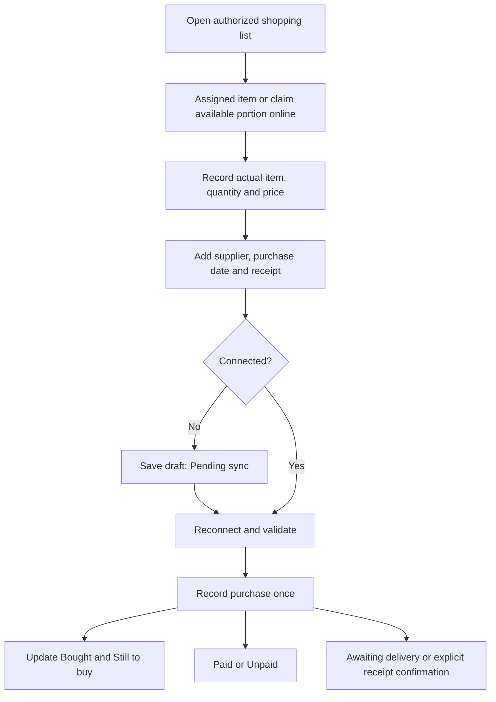

# DAC’S WorkMate — Mobile Purchasing

Date: 30 September 2026

Status: Agreed decisions consolidated for written review. Documentation only; no application or database changes implemented.

## Purpose and scope

Provide a mobile Purchasing workspace inside DAC’S WorkMate for authorized procurement staff, admin and owner. The user reports that staff handles roughly 95% of purchases and admin/owner the remaining 5%. Buyers need a usable phone workflow at suppliers and sites instead of relying on the desktop Web layout.

Use the same Flutter/Dart app and shared backend as the [WorkMate MVP](2026-09-29-unified-worker-app-design.md). Dacs Web remains available. This is not a second purchasing database or a separate app. Workers/team leaders retain their restricted views and cannot retrieve procurement amounts or receipt documents.

Project purchases remain Project Control only, with Main Contract or the relevant Additional Works selection. Warehouse purchases are also supported. This feature does not introduce PM purchasing or broaden financial authority for PM-limited owner accounts.

## Buyer assignment

- Admin/staff can assign items or quantity portions to authorized buyers.
- Authorized buyers can tap **I’ll buy this** to claim an unassigned portion.
- Show who is handling each portion to other authorized buyers.
- Claiming, releasing and reassigning shared assignments require internet and server validation.
- Taking over another buyer's portion is an explicit, recorded reassignment.
- Prevent simultaneous claims for the same portion. Claiming is not a purchase, inventory reservation or stock movement.

The shopping list should highlight urgent items and quantity changes and support practical views by purchasing batch and project. Supplier grouping is useful where a supplier is known; do not require one before an item can be requested.

## Purchasing flow

Purchase, payment and physical receipt are separate events. A recorded purchase does not prove payment or availability in inventory.

## Partial buying and clear wording

Use **Still to buy**, not **Outstanding**, on purchasing quantity displays. The Tagalog equivalent is **Kulang pang bilhin**.

Example:

| Label | Quantity |
|---|---|
| Needed | 10 pcs |
| Bought | 6 pcs |
| Still to buy | 4 pcs |

The buyer keeps the remaining 4 assigned unless they explicitly release them for another buyer. Do not automatically release a partially purchased assignment.

**Releasing never rewrites Needed.** If nothing was bought yet, releasing hands the whole assignment back unassigned. If part was bought, the rest becomes a separate claimable portion of the same request line; the original line still shows Needed 10, Bought 6, Released 4.

**Confirmed (30 September 2026): buying more than Still to buy is allowed with a required reason** (for example pack size, spare for breakage, cheaper in bulk). Record the actual purchase quantity; the extra is flagged for admin/staff and becomes usable stock only after confirmed receipt. It does not silently fulfill another request.

This example assumes all 10 require purchasing. When existing stock covers part of a request, calculate the purchasing shortage first. Do not show stock-covered quantities as still needing purchase. Preserve unit/specification and quantity-portion links, arranged quantities and changes from the original request rules.

## One receipt across projects

A single receipt/purchase may contain several item lines for different projects. Enter and attach the receipt once; link each line to its request and correct PC project/work selection or warehouse destination. Preserve project allocations without duplicating the purchase, payment or expense total.

The implementation plan must define how shared receipt charges, discounts and corrections reconcile to line allocations if supported. Do not invent allocations or confuse the billing-period identifier with the project identifier.

## Substitutes and unplanned purchases

Authorized buyers may record a substitute with a required reason. Keep the original request visible, record the actual replacement specification/unit and notify the requester. Different units are not automatically converted. Catalogue matching remains required before stock tracking; a replacement must not silently become stock of the original item.

Authorized buyers may record an **Unplanned purchase** without a prior request. Require a reason and valid Project Control project/work selection or warehouse destination. Keep it separate from requested quantities; it cannot silently fulfill an unrelated request. **Confirmed:** a warehouse destination is company stock cost, not any project's Spent, until the main owner assigns the issued portion to a project (see the MVP scope §4F warehouse rule).

## Paid or Unpaid

The MVP has **Paid** and **Unpaid** only. Partial-payment tracking is excluded.

**Confirmed by the user: project material purchases count toward Spent when recorded, whether Paid or Unpaid.** Marking Paid updates payment tracking only; it does not add another expense or change Spent or Profit by itself. An offline draft is not a recorded purchase until accepted by the server. General warehouse purchases retain the separate unassigned-stock-cost and owner-confirmed project assignment rules.

When marking a purchase Paid, record its payment **amount, actual date and method**, linked to the existing purchase. These payment details do not create another purchase or material expense. For an Unpaid purchase, add the payment details when it is paid.

For a receipt spanning projects, record the payment once at the purchase level; item lines retain their project allocations. Payment does not confirm delivery. Define amount validation, corrections and treatment of mismatches before implementation; do not silently classify a partial amount as full settlement or add a Partially paid workflow.

## Direct-to-site receiving

An authorized admin/staff buyer may confirm receipt in the same purchasing flow, while online. Require an explicit confirmation of actual received quantity, location and condition. Do not infer receipt from saving a purchase or uploading a receipt image.

Only actual confirmed usable quantities become available under existing inventory rules. Partial receipt leaves the rest awaiting delivery. Preserve separate purchase and receipt event identities so retries do not add stock twice. This approval does not expand worker/team-leader material receiving authority or resolve any additional owner receiving permission beyond existing rules.

## Offline drafts and changes

Buyers can save purchase details and receipt photos offline as drafts. Display **Pending sync**; do not update shared Bought totals, payment records or stock until validated server acceptance. Previously downloaded lists must show that they may be stale.

Reconnection rechecks assignment, permissions, current request changes and operation identity. If another buyer or staff changed the assigned portion, retain the draft and evidence for resolution. Do not silently discard a real purchase or count it twice. Offline drafts cannot guarantee that no other person has bought the goods; assignment and visible synchronization state reduce this risk.

Preserve drafts/photos across restart, isolate them by account and retain unsent attachments during cache cleanup. Final stock receipt, claims and reassignment remain online. Specify the exact conflict and payment-sync rules in the technical plan.

## Prototype and acceptance examples

1. Staff assigns part of a shopping list; another authorized buyer claims an unassigned portion online.
2. A buyer assigned 10 purchases 6. Show Bought 6 and Still to buy 4; retain the remaining assignment.
3. The buyer releases that 4 online so another buyer can claim it.
4. One receipt contains lines for two PC projects, with one payment and no duplicated costs.
5. Buyer records a substitute with a reason, preserving original and actual specifications.
6. Buyer records an unplanned warehouse purchase with a reason.
7. Purchase is Unpaid, later marked Paid with amount/date/method, without a second expense.
8. Buyer saves receipt details offline, then syncs safely after an assignment or quantity change.
9. Authorized staff records a direct-site purchase and explicitly confirms actual receipt online. A retry does not increase stock again.
10. Worker/team-leader screens and direct calls cannot access purchase prices or receipt files.

## Delivery boundary

### Resolve before Stage 2 implementation

- **Implement the confirmed purchase/payment rule:** project purchases affect Spent on recording regardless of payment status. Verify that recording payment never duplicates expense or changes Spent/Profit by itself; preserve separate warehouse cost assignment. The business decision is settled, not an open question.
- **Shared recording operation:** the current Web expense save splits costs across funding periods and routes overflow to Cover. Recommend one authoritative server-side purchase-recording operation for Web and Flutter, preserving verified allocation/Cover behavior, actual purchase quantities and safe retries. Do not duplicate that logic in Dart or bypass it from Web. This is a proposed implementation direction, not implemented infrastructure.
- **Billing-period selection:** decide whether the buyer selects eligible funding periods or the server proposes/assigns them, and how staff reviews exceptions. Project selection alone does not identify a billing period.
- **Buyer authorization and sign-in:** staff purchasing in WorkMate is approved, but define whether all staff qualify as buyers or need a per-person capability. Extend the existing worker/team-leader-only sign-in design deliberately. Staff-mode navigation must not grant Time In merely because purchasing access is enabled. Respect limited-owner scopes.
- **Shared receipt privacy:** define storage and line/document access under 0081 for receipts spanning projects. Access to one project must not automatically expose another project's receipt lines or amounts. Decide whether financial originals stay staff-only and project viewers receive scoped/redacted documents; do not solve this with a broad storage permission.
- **Instruction alignment:** before Stage 2 coding, update the blanket staff-peso rule in CLAUDE.md and any applicable AGENTS.md to document the approved procurement exception and preserved legacy payroll access. Keep unrelated owner-only records restricted. This spec does not itself modify those instruction files.

Design this workspace alongside the WorkMate prototype, clearly labelling simulated purchasing and inventory actions. Verified buying and receiving depend on the Stage 2 purchasing/inventory plan. Exact release sequencing, buyer authorization, payment representation, receipt allocation and migration from existing expense paths require an inspected implementation plan before coding.

The new mobile flow must reuse authoritative purchasing records and preserve current money rules. It must not become an additional stock-add path alongside the existing expense/inventory and delivery paths.
